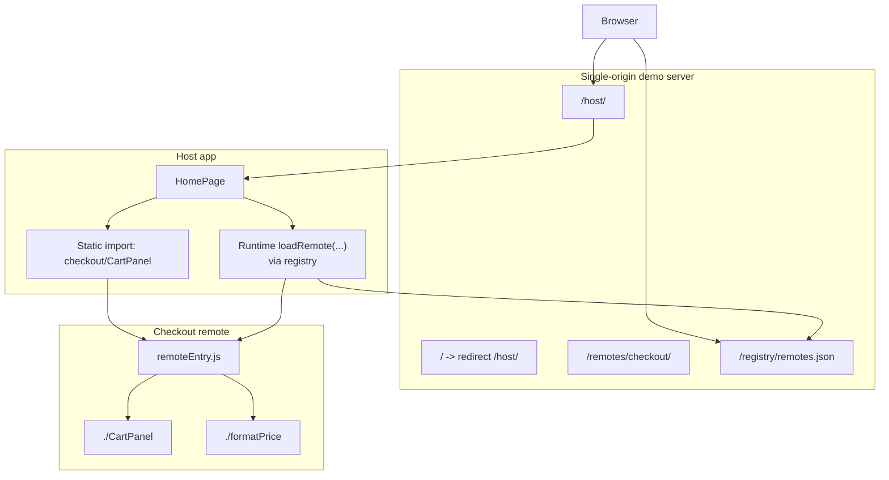
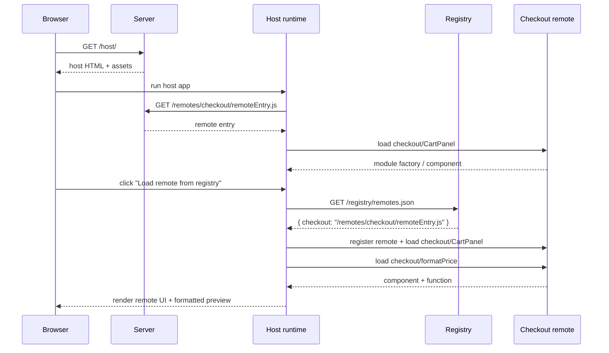

# Federated Modules Runtime Demo

This project is a small teaching-oriented implementation of Module Federation built to answer one very specific question: what does it actually mean to load modules at runtime, and how can that be demonstrated without turning the project into a large micro-frontend platform exercise?

The resulting shape is intentionally simple. There is a host app, a remote app, and a runtime registry, but all three are served from one public origin under different paths. That means the interesting complexity stays in the federation boundary rather than leaking into process management, ports, or CORS.

> [!summary]
> The project currently has three important identities:
> 1. a concrete Module Federation demo with both static and runtime-registered loading paths
> 2. a single-origin deployment experiment that keeps host, remote, and registry under one server
> 3. a documentation-heavy teaching project with a full ticket, implementation diary, and verification trail

## Why this project exists

Most Module Federation examples either stay too abstract or jump too quickly into "micro-frontends at scale" language. That makes it hard for a newcomer to answer the basic questions first:

- what is the host actually doing?
- what does the remote actually expose?
- what is the practical difference between a build-configured remote and a runtime-discovered remote?
- how much infrastructure is really necessary to demonstrate the idea honestly?

This project exists to answer those questions with a runnable artifact instead of a slide deck. The implementation is intentionally small enough that an intern can read the source in one sitting, but concrete enough to expose the real friction points: shared dependency configuration, remote module export shape, static versus runtime resolution, and path-based serving.

## Current project status

The repository is no longer just a design note. It now includes a working implementation plus the original ticket documentation.

What already exists:

- a remote Vite/React workspace at `/home/manuel/code/wesen/2026-03-22--federated-modules/apps/checkout-remote`
- a host Vite/React workspace at `/home/manuel/code/wesen/2026-03-22--federated-modules/apps/host`
- a same-origin registry file at `/home/manuel/code/wesen/2026-03-22--federated-modules/registry/remotes.json`
- a single-origin Express server at `/home/manuel/code/wesen/2026-03-22--federated-modules/server/serve-demo.mjs`
- a smoke script at `/home/manuel/code/wesen/2026-03-22--federated-modules/scripts/smoke-demo.mjs`
- a complete docmgr ticket at `/home/manuel/code/wesen/2026-03-22--federated-modules/ttmp/2026/03/22/FEDMOD-0001--federated-module-runtime-loading-demo/`

What is intentionally not part of the current scope:

- SSR
- multi-remote orchestration beyond one example remote
- auth or rollout policy for registry resolution
- Go-based serving or embedding

## Project shape

At a high level, the project has four layers:

1. **Remote application**
   - exposes `./CartPanel`
   - exposes `./formatPrice`
   - publishes a `remoteEntry.js` and federation manifest
2. **Host application**
   - renders local UI
   - demonstrates a static federated import
   - demonstrates a runtime registry-driven import
3. **Serving layer**
   - serves `/host/`
   - serves `/remotes/checkout/`
   - serves `/registry/remotes.json`
4. **Documentation and validation**
   - docmgr ticket
   - implementation diary
   - smoke script
   - reMarkable bundle delivery

## Architecture



The most important design decision in the project is that one server publishes all public URLs, but the applications are still separate builds and separate federation containers. That distinction matters. "Same origin" does not mean "same application". It only means the delivery surface has been simplified.

## How to run the project

The project currently has a build-then-serve flow.

### Build everything

```bash
cd /home/manuel/code/wesen/2026-03-22--federated-modules
npm install
npm run build
```

This produces:

- `/home/manuel/code/wesen/2026-03-22--federated-modules/apps/host/dist`
- `/home/manuel/code/wesen/2026-03-22--federated-modules/apps/checkout-remote/dist`

### Serve the built output

```bash
npm run serve
```

This starts the Express server and serves:

- `http://localhost:8080/host/`
- `http://localhost:8080/remotes/checkout/`
- `http://localhost:8080/registry/remotes.json`

### Run the smoke test

```bash
npm run smoke
```

This launches the server temporarily and verifies:

- `/host/` returns the built host HTML
- `/registry/remotes.json` exists
- `/remotes/checkout/remoteEntry.js` exists
- `/remotes/checkout/mf-manifest.json` exists

## The simplest mental model

The cleanest mental model for this project is:

1. the remote is a specialized bundle that publishes callable module entry points
2. the host knows how to ask for those entry points
3. the registry is only there to answer "where does this remote live right now?"
4. the server is only there to make those assets reachable under stable paths

If you keep that model in mind, the whole project becomes much easier to reason about.

## Implementation details

This is the part that matters most if you want to reproduce or modify the project.

### 1. The root workspace

The root workspace is defined in `/home/manuel/code/wesen/2026-03-22--federated-modules/package.json`.

It does three jobs:

- declares npm workspaces for the host and remote
- centralizes build and serve scripts
- owns shared dependencies like Express and TypeScript config

The important scripts are:

```json
{
  "build": "npm run build:remote && npm run build:host",
  "serve": "node ./server/serve-demo.mjs",
  "demo": "npm run build && npm run serve",
  "smoke": "node ./scripts/smoke-demo.mjs"
}
```

This choice keeps the project operationally boring. That is good. The point of the repo is federation behavior, not elaborate build orchestration.

### 2. The remote app

The remote workspace lives at `/home/manuel/code/wesen/2026-03-22--federated-modules/apps/checkout-remote`.

Its Vite configuration is the first real federation boundary:

```ts
federation({
  name: "checkout",
  filename: "remoteEntry.js",
  manifest: true,
  exposes: {
    "./CartPanel": "./src/components/CartPanel.tsx",
    "./formatPrice": "./src/utils/formatPrice.ts"
  },
  shared: {
    react: { singleton: true },
    "react-dom": { singleton: true }
  }
})
```

The important implementation detail is not only that the remote exposes a React component. It also exposes a plain utility function. That forces the project to teach the right lesson: Module Federation is not "a way to share UI", it is "a way to load modules across build boundaries at runtime".

The remote component itself lives in `/home/manuel/code/wesen/2026-03-22--federated-modules/apps/checkout-remote/src/components/CartPanel.tsx`.

That file ended up teaching one of the most useful runtime lessons in the repo: the static host path uses `React.lazy`, which expects a module promise resolving to a default export. The first browser verification failed because `CartPanel` existed only as a named export. The fix was to keep the named export but also add:

```ts
export default CartPanel;
```

That is a good example of a failure mode that would not be obvious from the architecture doc alone.

### 3. The host app

The host workspace lives at `/home/manuel/code/wesen/2026-03-22--federated-modules/apps/host`.

Its configuration uses a static remote definition:

```ts
remotes: {
  checkout: {
    type: "module",
    name: "checkout",
    entry: "http://localhost:8080/remotes/checkout/remoteEntry.js"
  }
}
```

That powers the "static" loading path, which is implemented in `/home/manuel/code/wesen/2026-03-22--federated-modules/apps/host/src/components/StaticRemoteSection.tsx`.

Conceptually, this is the simple mode:

```text
host build knows remote entry URL
-> page loads
-> React.lazy(import("checkout/CartPanel"))
-> federation runtime resolves checkout container
-> component renders
```

The second path is the more interesting one. The runtime-driven path lives across:

- `/home/manuel/code/wesen/2026-03-22--federated-modules/apps/host/src/runtime/registry.ts`
- `/home/manuel/code/wesen/2026-03-22--federated-modules/apps/host/src/runtime/federation.ts`
- `/home/manuel/code/wesen/2026-03-22--federated-modules/apps/host/src/components/RegistryRemoteSection.tsx`

The mental flow is:

```text
button click
-> fetch /registry/remotes.json
-> resolve checkout -> /remotes/checkout/remoteEntry.js
-> register remote in federation runtime
-> load checkout/CartPanel
-> load checkout/formatPrice
-> render component + show formatted price
```

The core runtime pseudocode looks like this:

```text
function loadRemoteModule(remoteName, request):
  entry = resolveRemoteEntry(remoteName)
  if entry changed or remote missing:
    registerRemotes([{ name: remoteName, entry }], { force: true })
  return federationRuntime.loadRemote(request)
```

This is the key difference between the two host sections:

- the static section relies on build-time remote configuration
- the dynamic section relies on runtime registry resolution and explicit remote registration

### 4. The registry

The registry is intentionally tiny:

```json
{
  "checkout": "/remotes/checkout/remoteEntry.js"
}
```

That file lives at `/home/manuel/code/wesen/2026-03-22--federated-modules/registry/remotes.json`.

The most important design choice here is that the value is relative, not absolute. That keeps the registry portable across the same-origin server. If the origin changes, the registry file does not need to be rewritten as long as the path contract stays stable.

### 5. The server

The server lives at `/home/manuel/code/wesen/2026-03-22--federated-modules/server/serve-demo.mjs`.

Its job is minimal:

```js
app.get("/", (_req, res) => {
  res.redirect("/host/");
});

app.use("/registry", express.static(registryDir));
app.use("/remotes/checkout", express.static(remoteDistDir));
app.use("/host", express.static(hostDistDir));
```

That is deliberately plain. It does not proxy. It does not inject configuration. It does not try to coordinate build systems. It simply publishes stable path prefixes.

This is an important teaching choice because it cleanly separates concerns:

- Vite builds the host
- Vite builds the remote
- the server publishes both outputs
- the browser runtime performs federation

### 6. The verification story

The smoke script lives at `/home/manuel/code/wesen/2026-03-22--federated-modules/scripts/smoke-demo.mjs`.

It checks server reachability and asset presence, which is necessary but not sufficient. The project also required a real browser pass because server-level success does not guarantee a valid remote module shape.

The verification sequence that actually mattered was:

1. `npm install`
2. `npm run build:remote`
3. `npm run build:host`
4. `npm run smoke`
5. open `http://localhost:8080/host/`
6. confirm static remote section renders
7. click "Load remote from registry"
8. confirm the runtime-loaded section renders
9. confirm browser console is clean

## Runtime flow as a sequence



## Failure modes and tricky details

This project is small enough that the tricky parts are very concentrated.

### `React.lazy` module shape

The host's static loading path assumes the imported module resolves to a default React component. If the remote only exports a named component, the app will build but fail in the browser.

That exact bug happened here. The fix was to add a default export in `CartPanel.tsx`.

### Smoke tests are necessary but not sufficient

A smoke script can prove:

- the server starts
- the registry exists
- `remoteEntry.js` exists
- the manifest exists

It cannot prove:

- a remote component has the correct export shape
- the host renders a valid React element
- the browser runtime is free of console errors

That is why this repo needs both automated smoke verification and a browser pass.

### Same origin does not remove federation complexity

Serving everything from one origin removes CORS and port juggling, but it does not remove:

- remote entry resolution
- shared dependency behavior
- export-shape assumptions
- dynamic registration logic

This is good. The project simplifies the operational noise without hiding the real technical boundary.

## Current user-facing commands

The current working commands are:

```bash
cd /home/manuel/code/wesen/2026-03-22--federated-modules
npm install
npm run build
npm run serve
npm run smoke
```

If you want the shortest path:

```bash
npm run demo
```

That builds the host and remote, then starts the server.

## Important project docs

Repo-local implementation docs:

- `/home/manuel/code/wesen/2026-03-22--federated-modules/ttmp/2026/03/22/FEDMOD-0001--federated-module-runtime-loading-demo/index.md`
- `/home/manuel/code/wesen/2026-03-22--federated-modules/ttmp/2026/03/22/FEDMOD-0001--federated-module-runtime-loading-demo/design-doc/01-federated-module-demo-analysis-design-and-implementation-guide.md`
- `/home/manuel/code/wesen/2026-03-22--federated-modules/ttmp/2026/03/22/FEDMOD-0001--federated-module-runtime-loading-demo/reference/01-investigation-diary.md`
- `/home/manuel/code/wesen/2026-03-22--federated-modules/ttmp/2026/03/22/FEDMOD-0001--federated-module-runtime-loading-demo/reference/02-runtime-api-and-experiment-notes.md`

Primary implementation code:

- `/home/manuel/code/wesen/2026-03-22--federated-modules/apps/host/`
- `/home/manuel/code/wesen/2026-03-22--federated-modules/apps/checkout-remote/`
- `/home/manuel/code/wesen/2026-03-22--federated-modules/server/serve-demo.mjs`
- `/home/manuel/code/wesen/2026-03-22--federated-modules/registry/remotes.json`

## Open questions

- Should the next version keep Express, or replace it with a Go static server so the same path model is served from one Go binary?
- Should the host add a second remote so the registry story feels more like a real platform?
- Should the project eventually include a proxy-based development mode with hot reload under one public origin?
- Should the host add explicit error boundaries around the static and runtime-driven sections for a friendlier failure story?

## Near-term next steps

- replace the static Node server with a Go server if the project direction shifts toward a Go-centric runtime
- add one more remote to make the registry story more realistic
- add a browser-driven end-to-end test so the current manual verification is partially automated
- document the exact federation artifacts in `dist/` more explicitly, including `remoteEntry.js` and `mf-manifest.json`

## Project working rule

> [!important]
> Keep the deployment story simpler than the federation story.
> The point of the project is to teach runtime loading, not to bury it inside multi-process operational noise.
